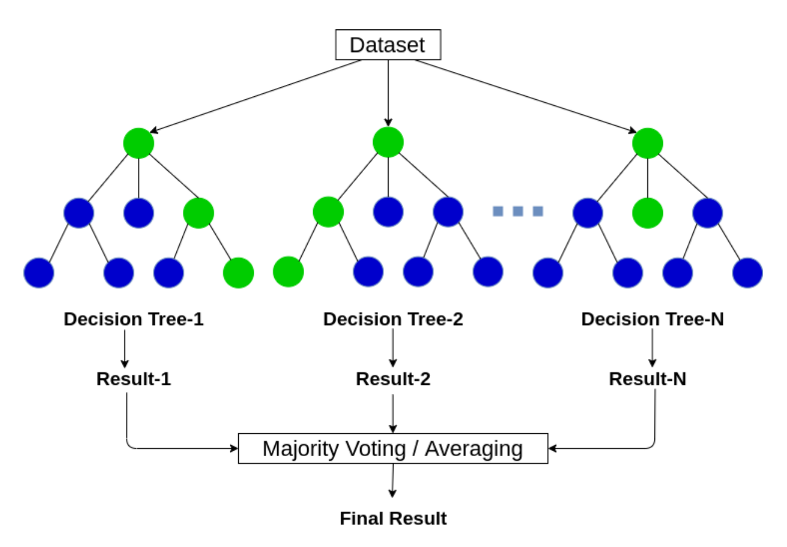

# Riiid AIEd Challenge 2020

## About the Project

## Goals
The goal of this project is to create a machine learning model that predicts whether users will answer questions correctly.

## Background

### About Riiid Labs
> “Riiid Labs, an AI solutions provider delivering creative disruption to the education market, empowers global education players to rethink traditional ways of learning leveraging AI. With a strong belief in equal opportunity in education, Riiid launched an AI tutor based on deep-learning algorithms in 2017 that attracted more than one million South Korean students. This year, the company released EdNet, the world’s largest open database for AI education containing more than 100 million student interactions.” [source](https://www.kaggle.com/c/riiid-test-answer-prediction/overview)

  
More Info:  Click to Expand 

 
### Education Platform: Santa TOEIC (Test of English for International Communication)
> “Santa TOEIC is the AI-based web/mobile learning platform for TOEIC. AI tutor provides a one-on-one curriculum, effectively increasing scores based on the essential questions and lectures for each user.” [source](https://www.riiid.co/en/product)

### TOEIC: Listening and Reading
> “The TOEIC Listening & Reading test is an objective test… There are 200 questions to answer in two hours in Listening (approximately 45 minutes, 100 questions) and Reading (75 minutes, 100 questions).” [source](https://www.iibc-global.org/english/toeic/test/lr/about/format.html)

## Deliverables
- [MVP Notebook](https://github.com/Riiid-Team/Riiid-Project/blob/main/MVP.ipynb)
- Final Notebook
- [Slide Presentation](https://www.canva.com/design/DAEQJVWzMfI/xLQVCWT7rMXS3qD22awfGA/view?utm_content=DAEQJVWzMfI&utm_campaign=designshare&utm_medium=link&utm_source=sharebutton)
- Video presentation
- Submission to Kaggle competition

## Project Management 
- [Trello Board](https://trello.com/b/HK21qlYW) 
- [Capstone Standup](https://docs.google.com/document/d/1tSexQKQZE7XicJyN401ZG8SlkKxIRokE44qmFS5kDZI/edit?usp=sharing)
- [Knowledge Share](https://docs.google.com/document/d/1W8FVh89gN6bMn85uHgqLIz50elTtU2H9-R7jwpOUBRw/edit?usp=sharing)

## Data Dictionary

### Original Dataset
 
**`train.csv`**
| Feature Name                | Description                                                                                 |
|-----------------------------|---------------------------------------------------------------------------------------------|
| row_id                      | (int64) ID code for the row                                                                 |
| timestamp                   | (int64) The time in milliseconds between this user interaction and the first event completion from the user |
| user_id                     | (int32) ID code for the user                                                                |
| content_id                  | (int16) ID Code for the user interaction                                                    |
| content_type_id             | (int8) 0 if the event was a question being posed to the user, 1 is the event was watching a lecture|
| task_container_id           | (int16) ID code for the batch of questions or lectures. -1 for lectures                     |
| user_answer                 | (int8) The user's answer to the question, if any. -1 for lectures                           |
| answered_correctly          | (int8) If the user responded correctly, if any. -1 for lectures                             |
| prior_question_elapsed_time | (float32) The average time in milliseconds it took a user to answer each question in the previous question bundle, ignoring any lectures inbetween. Null for a user's first question bundle or lecture. Note: The time is the average time a user took to solve each question in the previous bundle.|
| prior_question_had_explanation | (bool) Whether or not the user saw an explanation and the correct response(s) after answering the previous question bundle, ignoring any lectures in between. The value is shared across a single question bundle, and is null for a user's first question bundle or lecture. Typically the first several questions a user sees were part of an onboarding diagnostic test where they did not get any feedback. |

**`lectures.csv`**  metadata for the lectures watched by users as they progress in their education.
| Feature Name                | Description                                                                                 |
|-----------------------------|---------------------------------------------------------------------------------------------|
| lecture_id                  | Foreign key for the train/test content_id column, when the content type is lecture (1).     |
| part                        | Top level category code for the lecture.                                                    |
| tag                         | One tag code for the lecture. The meaning of the tags will not be provided, but these codes are sufficient for clustering the lectures together.  |
| type_of                     | Brief description of the core purpose of the lecture.                                       |

**`questions.csv`**  metadata for the __questions__ posed to users.
| Feature Name                | Description                                                                                 |
|-----------------------------|---------------------------------------------------------------------------------------------|
| question_id                 | Foreign key for the train/test content_id column, when the content type is question (0).    |
| bundle_id                   | Code for which questions are served together.                                               |
| correct_answer              | The answer to the question. Can be compared with the train user_answer column to check if the user was right.  |
| part                        | The relevant section of the TOEIC test.                                                    |
| tags                        | One or more detailed tag codes for the question. The meaning of the tags will not be provided, but these codes are sufficient for clustering the questions together. |

### Feature Engineering
| Feature Name                | Description                                                                                 |
|-----------------------------|---------------------------------------------------------------------------------------------|
| question_had_explanation    | Indicates if a question had an explanation                                                  |
| user_acc_mean               | The number of questions a user answered correctly divided by all questions they've answered |
| user_lectures_running_total | The running total of lectures a user has watched at a given timestamp                       |
| avg_user_q_time             | The average amount of time a user spends on a question                                      |
| mean_content_accuracy       | The number of questions a user answered correctly divided by all questions they've answered in different content/topics|
| mean_task_accuracy          | The average accuracy for a given task                                                       |
| median_content_accuracy     | The median accuracy for a specific content type                                             |
| median_tesk_accuracy        | The median accuracy for a task                                                              |
| q_time                      | The amount of time a user spent on the previous question                                    |
| question_content_asked      | The type of question asked                                                                  |
| question_priortime_asked    | The timestamp of the previous question prompted to the user                                 |
| question_task_asked         | The type of question asked in a bundle                                                      |
| question_timestamp_asked    | The timestamp a question was prompted to the user                                           |
| std_content_accuracy        | The standard deviation of content accuracy                                                  |
| std_task_accuracy           | The standard deviation of task accuracy                                                     |
| std_timestamp_accuracy      | The standard deviation of accuracy for a given timestamp                                    |
| skew_content_accuracy       | The skewness of accuracy for a specific content type                                        |
| skew_task_accuracy          | The skewness of accuracy for a specific task                                                |
| skew_timestamp_accuracy     | The skewness of accuracy for a given timestamp                                              |
| avg_user_q_time [scaled]    | Scaled version of avg_user_q_time using MinMaxScaler. Returned from prep_riiid function     | 
| user_lectures_running_total [scaled] | Scaled version of user_lectures_running_total using MinMaxScaler. Returned from prep_riiid function |

## Initial Thoughts
- Are questions with explanations answered correctly more often?
- Do users with higher accuracy take longer to answer questions?
- Are there questions that are more difficult to answer than others?
- How long does the average user engage with the platform?
- Does the number of lectures a user watch impact their accuracy?

## Project Steps
### Acquire
Data acquired from [Kaggle](https://www.kaggle.com/c/riiid-test-answer-prediction/data). The data is stored in three separate files: lectures.csv, questions.csv, and train.csv. The primary dataset is train.csv, which has 100+ million user interactions from 390,000+ users. We used a random sample of 100K users for our analysis. The original 10 features describe the type of question, the time it took to answer, and whether the user’s response was correct.

### Prepare
**Missing Values**
- Filled missing boolean values in `question_had_explanation` with False. Missing values indicated that the question did not have an explanation or the user viewed a lecture.
- Filled missing values in `prior_question_elapsed_time` with 0. Missing values indicated that a user viewed a lecture before answering the first question in a bundle of questions.
- Dropped columns: `lecture_id`, `tag`, `lecture_part`, `type_of`, `question_id`, `bundle_id`, `correct_answer`, `question_part`, and `tags`
- Dropped rows considered lectures: Where `answered_correctly` = -1

**Feature Engineering**
- Created new features using descriptive statistics for content, task, timestamp, and whether a question had an explanation. 
- Scaled timestamp from milliseconds to weeks to look at trends overtime.
- Refer to the feature engineering data dictionary for more information.

**Preprocessing**
- Scaled `mean_timestamp_accuracy`, `mean_priortime_accuracy`, `user_lectured_running_total`, and `avg_user_q_time` using MinMaxScaler

### Explore
- Used scatterplots and histograms to visualize interactions between features and the target variable.
- Performed hypothesis tests to find statistically significant relationships between features.

#### Hypotheses
**Hypothesis – Answered correctly vs. Question had an explanation**
> Null hypothesis: Answering a question correctly is independent of whether a question had an explanation. 
> Alternative hypothesis: Answering a question correctly is dependent on whether a question had an explanation. 
> Test: Chi-Squared Test 
> Results: With a p-value less than alpha, we reject the null hypothesis.

**Hypothesis – Number of lectures a user has watched vs. Average task accuracy**
> Null hypothesis: There is no linear relationship between the number of lectures a user has watched and their average task accuracy. 
> Alternative hypothesis: : There is a linear relationship between the number of lectures a user has watched and their average task accuracy. 
> Test: Pearson Correlation Test 
> Results: With a p-value less than alpha, we reject the null hypothesis.
> -	On average, as the number of lectures a user has seen increases, so does their task accuracy.
> -	Viewing lectures may have a weak positive impact on user accuracy.

**Hypothesis – Average user question time vs. Average user accuracy**
> Null hypothesis: There is no linear relationship between the average time a user takes to answer a question and their average accuracy. 
> Alternative hypothesis: There is a linear relationship between the average time a user takes to answer a question and their average accuracy. 
> Test: Pearson Correlation Test 
> Results: With a p-value less than alpha, we reject the null hypothesis
> -	Users who take longer to answer questions tend to have lower overall accuracy and vice versa

**Hypothesis – Average user accuracy vs. Average content accuracy**
> Null hypothesis: There is no significant difference between users with above average accuracy and users with average or lower-than-average accuracy on questions with lower-than-average content accuracy. 
> Alternative hypothesis: There is a significant difference between users with above average accuracy and users with average or lower-than-average accuracy on questions with lower-than-average content accuracy. 
> Test: Two-Sample Two-Tailed T-Test 
> Results: With a p-value less than alpha, we reject the null hypothesis.
> -	If users with above average accuracy answer questions (difficult and otherwise) more quickly than others users, then they may be more prepared for the content.

**Feature Selection**
- Used Recursive Feature Elimination to select the top 5 features: `prior_question_had_explanation`, `user_acc_mean`, `mean_content_accuracy`, `mean_task_accuracy`, and `mean_priortime_accuracy_scaled`.
- Used SelectKBest to select the top 5 features: `mean_content_accuracy`,`user_acc_mean`,`mean_task_accuracy`,`avg_user_q_time_scaled`, `prior_questoin_had_explanation`.
- We selected the 4 features that both lists had in common.
> 1. mean_content_accuracy
> 2. user_acc_mean
> 3. mean_task_accuracy
> 4. prior_question_had_explanation
- In the interest of time, we used all of the features from exploration to build our MVP models. In the next iteration of this project we will limit the features used in modeling.

### Model
First, a baseline model was created to compare our model performances. The baseline is the most common outcome from the training dataset, answered correctly = 1. Baseline accuracy is 50%. This means that a user will get an answer correct 50% of the time.
Models evaluated on train, validate, and the test set were:
-	Logistic Regression
-	Decision Tree
- Random Forest
- AdaBoost
- Gradient Boost
-	K-Nearest Neighbors
-	Naive Bayes
-	Neural Net

### Final Model
Random Forest was the final model selected. It performed the best with an AUC score of .692. Emphasis was placed on reducing False Positives. A False Positive means our model predicted that a user answered a question correctly, when their answer was actually incorrect.

> A Random Forest algorithm creates a large number of individual decision trees (models) and combines them to produce a predictive model.

### Conclusions
#### What was best model?
- Random Forest: AUC score of .692

### Future Investigations
#### What are your next steps?
- Use this predictive model on Riiid's other educational programs.
- Explore more features and different modeling like xgboost and lightlgbm.
- Improve model to predict new student performance.

## How to Reproduce
All files are reproducible and available for download and use.
- [x] Read this README.md
- [ ] Download the aquire.py, prepare.py, and MVP.ipynb files
- [ ] Run MVP.ipynb

## Contact Us 
Daniella Bojado
- daniella.bojado@gmail.com 

Samuel Davila
- samuelrdavila@gmail.com

Yongliang Shi
- yongliang.michael.shi@gmail.com

Christopher Logan Ortiz
- christopher.logan.ortiz@gmail.com
